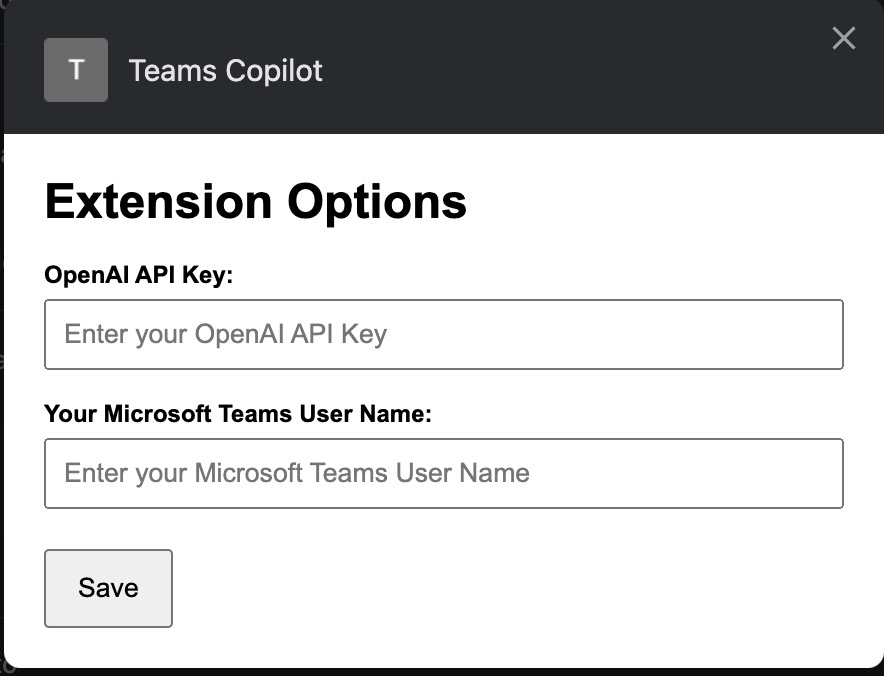

# SmartReply

**SmartReply** is a Chrome extension that enhances your messaging productivity across Microsoft Teams, Slack, and Telegram Web. Powered by OpenAI's GPT models (like GPT-4o), SmartReply offers context-aware suggestions, polished completions, and tone-customizable replies—so you can communicate faster and more effectively.

## ✨ Key Features

- **Multi-Platform Support**: Works seamlessly with Microsoft Teams, Slack, and Telegram (Web versions).
- **Context-Aware Suggestions**: Automatically extracts recent chat history to generate relevant replies.
- **Keyword-Guided Generation**: Enter keywords to guide SmartReply's response direction and intent.
- **Proofreading & Completion**: Paste a draft message to refine or complete it intelligently.
- **Tone Control**: Add tone/style tags like `[formal]`, `[friendly]`, `[concise]` for customized results.
- **One-Click Copy**: Click any suggestion to instantly copy it to your message input area.

## 🚀 Installation & Setup

### 1. Install SmartReply
Download and add the extension from the Chrome Web Store or load it via Developer Mode in Chrome.

### 2. Configure Settings
- Right-click the SmartReply icon and select **Options**.
- Enter your:
  - **OpenAI API key**
  - **Display name** (as used in your chat platform)

### 3. Start Using
- Navigate to the web version of Microsoft Teams, Slack, or Telegram.
- Click the SmartReply icon in the Chrome toolbar to launch the popup and view recent messages.
- Use the **"Suggest Input"** button to generate AI-powered message suggestions.

## 💡 Usage Guide

### Modes of Input
- **No Input**: Automatically generates a context-aware message from chat history.
- **Keywords Only**: Type keywords (e.g., `project deadline [formal]`) to shape the reply.
- **Draft Input**: Paste a rough message to improve or complete it.

### Tone Modifiers
Use square-bracket tags like:
- `[formal]`
- `[casual]`
- `[friendly]`
- `[concise]`
- `[apologetic]`

### Interacting with Suggestions
- Up to three suggestions are generated.
- Click any suggestion to copy it into the current chat input box.

## 💬 Examples

| Input | Output Example |
|-------|----------------|
| *(empty)* | “Thanks for the update! Let me know if you need anything else.” |
| `meeting summary [concise]` | “Meeting concluded. Key outcomes: budget approved, deadline extended to July 10.” |
| `Can you explain` | “Can you explain how this change affects our current workflow?” |

## 🛠️ Roadmap

- [ ] Support for WhatsApp Web
- [ ] Save favorite responses or templates
- [ ] UI themes and personalization
- [ ] Team-based tone presets

## 📄 License

This project is licensed under the [Apache License 2.0](LICENSE).