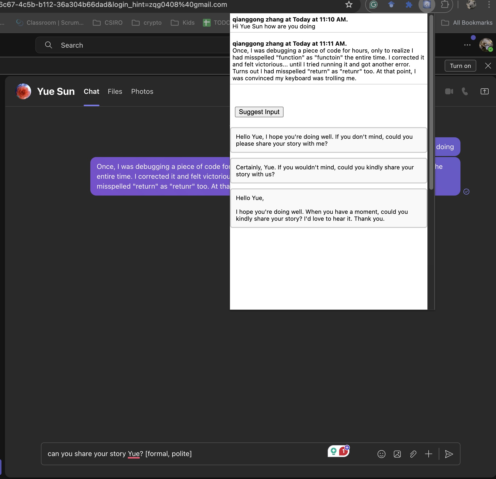

# TeamsCopilot

**TeamsCopilot** is a Chrome extension designed to enhance your Microsoft Teams Web experience by using OpenAI's GPT APIs to suggest clear, professional, and contextually appropriate messages. By extracting recent chat history as the conversational context, TeamsCopilot generates smart message suggestions that fit seamlessly into your conversation flow. Whether you need polished replies, help completing a thought, or just the perfect opening line, TeamsCopilot has you covered.

## Features

- **Context-Aware Suggestions**: Extracts chat history to provide contextually relevant responses.
- **Keyword-Based Input**: Generate messages based on a few keywords to guide the tone and intent.
- **Proofreading and Completion**: Input a draft for TeamsCopilot to proofread and enhance, or get a complete response when you leave the input blank.
- **Adjustable Tone**: Use square-bracket instructions like `[formal]` or `[casual]` to control the tone of the response.
- **Quick Copy-Paste**: Click on a suggestion, and it will automatically copy to the Microsoft Teams input area for easy editing or sending.

## Installation and Setup

1. **Install the Extension**: Download and add TeamsCopilot to your Chrome browser.
2. **Configure API Key and Name**:
   - Right-click the TeamsCopilot icon in the toolbar and select **Options**.
   - Enter your OpenAI API key and your display name as it appears in Microsoft Teams.
   

   <!--  -->
   

3. **Start Using TeamsCopilot**:
   - Left-click the TeamsCopilot icon to open the dropdown window and access the latest chat history.

## Usage Guide

1. **Opening the TeamsCopilot Window**:
   - Click on the extension icon to view the dropdown, where recent chat messages are displayed along with an **"Suggest Input"** button.

    <!--  -->
    

2. **Generating Suggestions**:
   - **Empty Input**: Pressing "Suggest Input" without typing anything will prompt TeamsCopilot to generate a sensible continuation of the conversation based on the latest chat context.
   - **Keyword Input**: Type in a few keywords to guide the AI's response. For example, entering "deadline update" will produce suggestions focused on discussing project deadlines.
   - **Complete Draft**: Enter a full or partial message if you want TeamsCopilot to refine or complete your text.

3. **Adding Tone or Style Instructions**:
   - To adjust the tone or style, include instructions in square brackets, such as `[formal]`, `[casual]`, or `[concise]`. TeamsCopilot will interpret these to tailor its response to your preference.

4. **Viewing and Selecting Suggestions**:
   - TeamsCopilot generates up to three suggestions by default.
   - Click on a suggestion to copy and paste it directly into the Microsoft Teams input area. You can make any final edits before sending.

## Example Commands

- **Empty**: [Click "Suggest Input"] → *TeamsCopilot suggests contextually appropriate message.*
- **Keywords**: "project update [formal]" → *Generates a formal update message about the project.*
- **Draft Input**: "Could you provide more details on" → *TeamsCopilot completes the sentence in a polished, professional tone.*

## License

This project is licensed under the Apache License 2.0.
